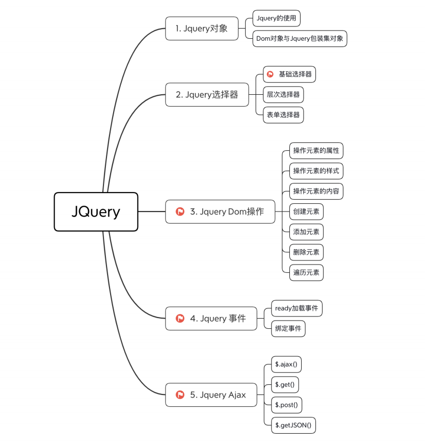

# 介绍

官网：http://jquery.com/

- jquery是原生JavaScript封装的框架，可以很好的减少js语法的繁琐写法
- jQuery 是一个工具库，封装的是DOM 操作 + 事件 + Ajax + 动画等常用网页交互逻辑；
- 它没有封装 JS 的基础语法和浏览器提供的 window 全局对象；
- 你还是在写 JavaScript，只是用 jQuery 提供的快捷方式来写而已。
- 核心作用
    - 简化 DOM 操作：比如查找元素、修改内容、设置样式等，比原生 JS 写法更简洁。
    - 处理浏览器兼容性：封装了浏览器差异，代码可在主流浏览器中一致运行。
    - 事件处理：绑定点击、键盘等事件更方便。
    - 动画效果：实现淡入淡出、滑动等动画。
    - AJAX 请求：用简单语法发送和处理异步请求。

```javascript
// 原生 JavaScript
document.getElementById("btn").addEventListener("click", function () {
    alert("Clicked!");
});

// jQuery 写法
$("#btn").click(function () {
    alert("Clicked!");
});
```

# jQuery大纲

